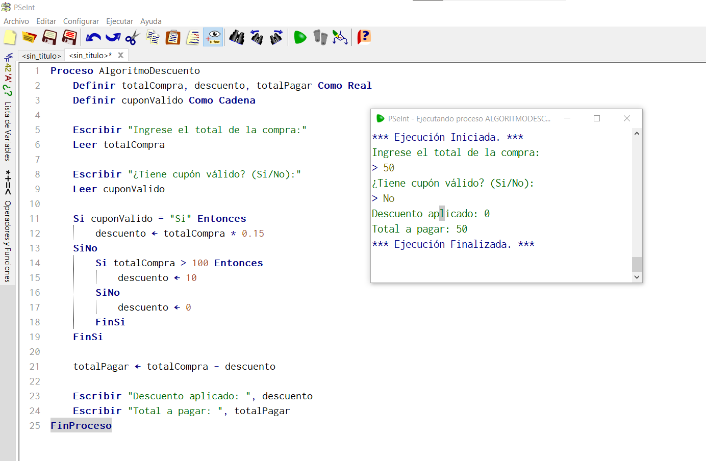
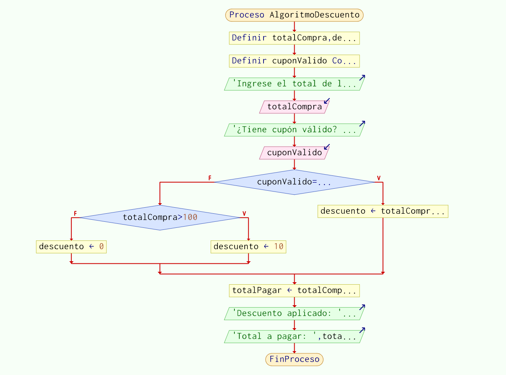
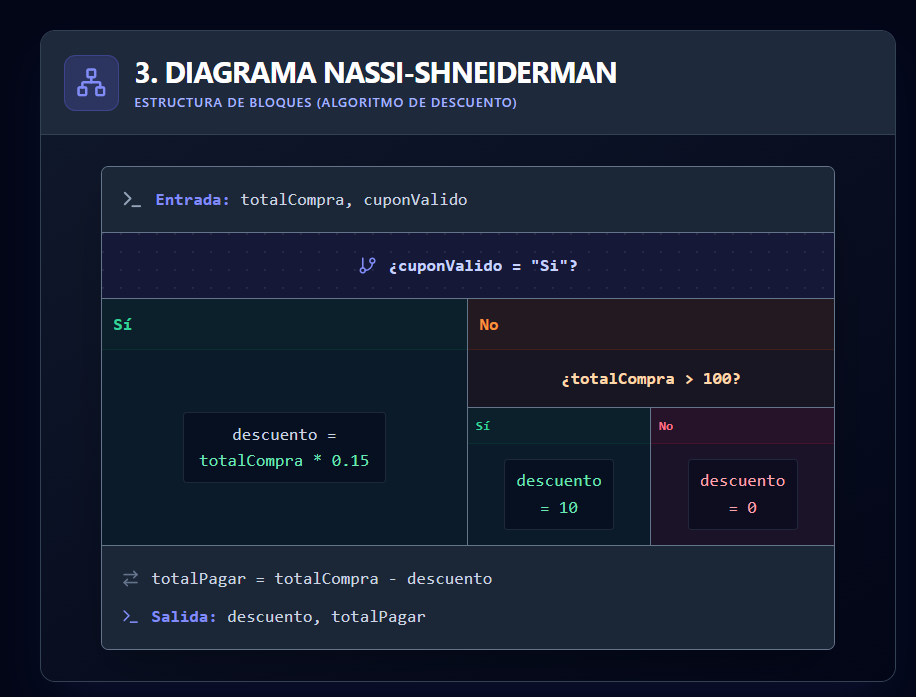
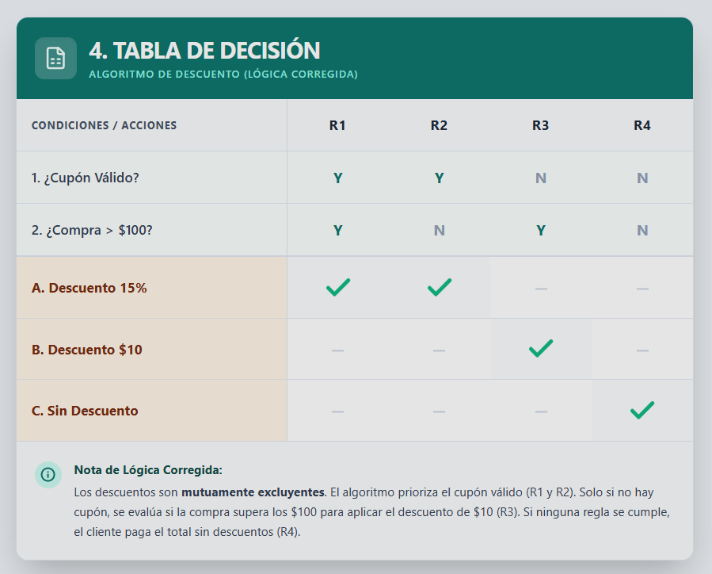
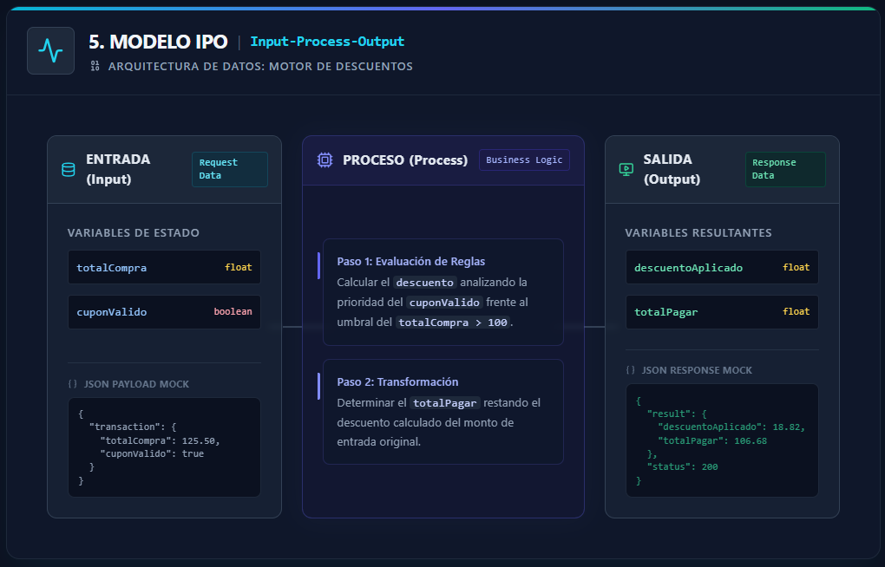
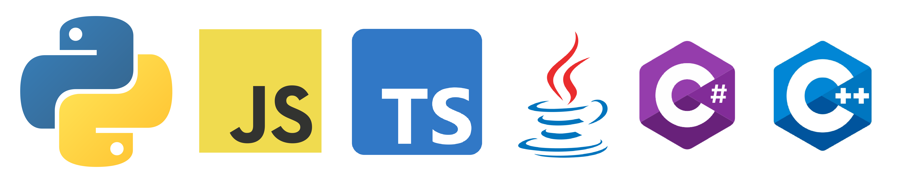
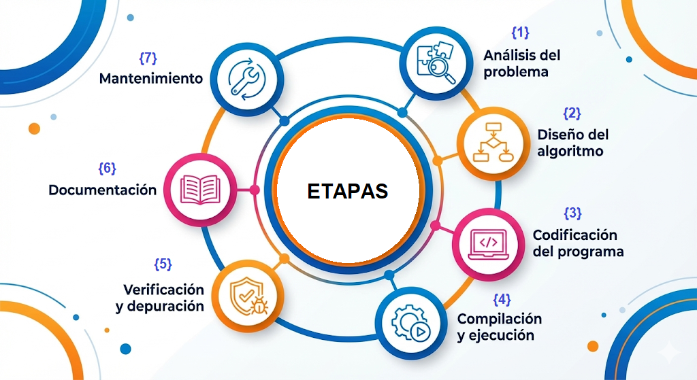

# ALGORITMOS
## Definición

Muchos autores hablan acerca del origen de la palabra Algoritmo. Knuth(1997) señala que la palabra algoritmo aparece en el año 1957 en el Webster's New World Dictionary, pero con la palabra algorismo, que apoya la teoría de que esta palabra proviene de su significado antiguo: guarismos arábicos usados para el proceso de hacer aritméticas. Pero los historiadores matemáticos afirman que se debe al nombre del autor de un libro de texto Persa Abu Ja'far Mohammed ibn Musa al-Khowarizmi (825), quien fuera considerado el padre del álgebra.

Asi mismo, Knuth(1997) indica que la palabra algoritmo era asociado a Euclides, por el famoso "Algoritmo de Euclides", lo que ayuda a hallar el máximo común divisor de dos números. Sin embargo, Leipzig(1747) define la palabra Algorithmus como la combinación de las nociones de los cuatro tipos de cálculo aritmético, suma, multiplicación, resta y división.
Según Arteaga(2023) define el algoritmo como una secuencia de pasos lógicos, ordenados y finitos para resolver un problema, y lo explica desde la lógica de entrada, proceso y salida, que es muy útil para una clase inicial en PSeInt.

---

## Características de un algoritmo

1. Finito: Los algoritmos deben tener un numero de pasos que logren un fin y debe tener final.
2. Precisión: Los algoritmos deben ser precisos y mostrar claridad sin ambigüedades. 
3. Entrada: Puede inicializarse con cero o mas datos.
4. Salida: De ser capaz de mostrar uno o varios resultados relacionados con la entrada.
---

## Tipos de algoritmo 
### 1. Por su naturaleza
*A. Cualitativos:* Utilizan procesos verbales o de manera descriptiva.

*B. Cuantitativos:* Utilizan cálculos matemáticos.

### 2. Por el tipo de problema que resuelven:
- Algoritmos de ordenamiento
- Algoritmos de búsqueda
- Algoritmos de grafos
- Algoritmos de cadenas o strings
- Algoritmos de compresión
- Algoritmos de flujo en redes

### 3. Por el método de diseño:
- Divide and Conquer
- Dynamic Programming
- Greedy Algorithms
- Randomized Algorithms
- Combinatorial Search 
- Approximation Algorithms
- Local Search
- Multithreaded 

### 4. Según el uso de la IA
- Aprendizaje supervisado: actúan por un conjunto de datos etiquetados, aquellos datos que se entienden pueden ser de manera predictiva.
- Aprendizaje no supervisado: Parten del conjunto de datos sin etiquetar, no es capaz de predecir etiquetas. 
- Aprendizaje por refuerzo: Su objetivo es crear el “agente” que aprende a partir de interacciones con el entorno.

---

## Heramientas Algorítmicas
**1. Pseudocódigo:** Es una forma de escribir la lógica de un algoritmo con palabras sencillas y ordenadas, parecida a un programa, pero sin preocuparse todavía por un lenguaje de programación específico.

  </h1>

---

**2. Diagrama de flujo:** Es la representación gráfica de un algoritmo mediante figuras y flechas que muestran el orden de las acciones, decisiones y resultados.

  </h1>

---

**3. Diagrama Nassi-Shneiderman:** Es una forma visual de organizar un algoritmo en bloques, mostrando de manera clara la secuencia, las decisiones y las repeticiones, sin usar flechas como en el diagrama de flujo.

  </h1>

 

---

**4. Tabla de decisión:** Es una herramienta que ayuda a ordenar condiciones y posibles acciones en una tabla, para ver con claridad qué debe hacerse en cada caso.

  </h1>

---

**5. IPO (Entrada–Proceso–Salida):** Es un esquema simple que permite entender un algoritmo identificando qué datos ingresan, qué se hace con ellos y qué resultado se obtiene.

  </h1>

---

## Programa y Lenguajes de programación
1. Programa: Conjunto de instrucciones finitos que traduce la computadora para resolver problemas.
2. Lenguajes de programación: Es un sistema de reglas y palabras clave que usamos para darle instrucciones a una computadora y hacer que ejecute tareas, resuelva problemas o construya programas.

  </h1>

---

## Etapas para la solución de problemas

  </h1>

---

## CONTENIDO
## Enfoque de este espacio
Este espacio ha sido organizado para aprender algoritmos de manera progresiva, comenzando por los fundamentos y avanzando hacia ejercicios y problemas de mayor dificultad. La idea es construir una base lógica sólida antes de abordar retos más complejos.

## Autor

**SHELVY CARRASCO ORÉ**
- GitHub: [@scarrascoore](https://github.com/scarrascoore)
- LinkedIn: [Shelvycarrascoore](https://linkedin.com/in/shelvycarrascoore)